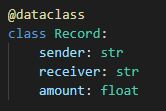
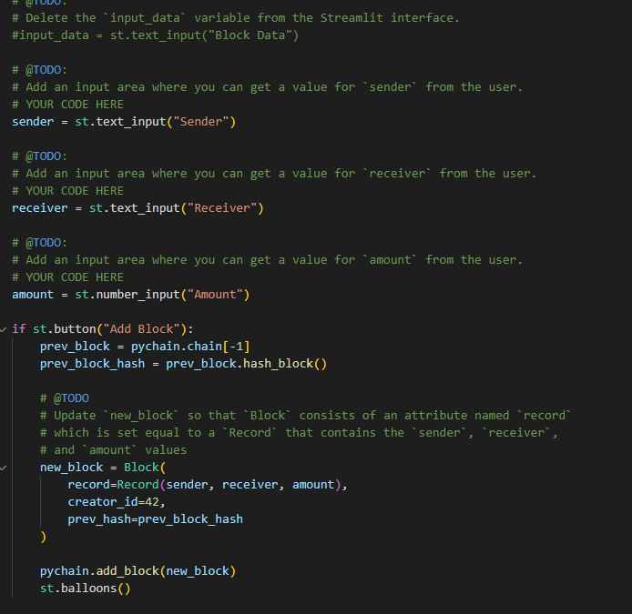
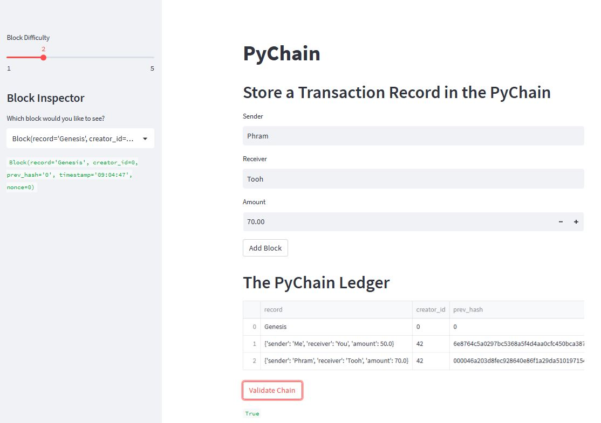
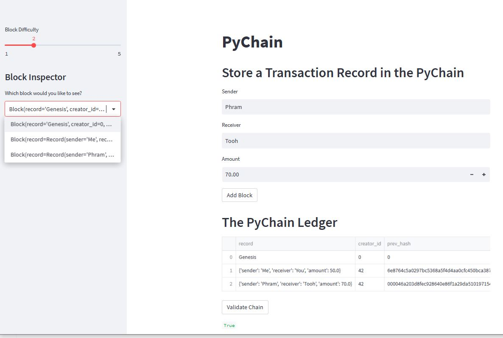

# PyChain Ledger

You’re a fintech engineer who’s working at one of the five largest banks in the world. You were recently promoted to act as the lead developer on their decentralized finance team. Your task is to build a blockchain-based ledger system, complete with a user-friendly web interface. This ledger should allow partner banks to conduct financial transactions (that is, to transfer money between senders and receivers) and to verify the integrity of the data in the ledger.

You’ll make the following updates to the provided Python file for this assignment, which already contains the basic `PyChain` ledger structure that you created throughout the module:

1. Create a new data class named `Record`. This class will serve as the blueprint for the financial transaction records that the blocks of the ledger will store.

2. Modify the existing `Block` data class to store `Record` data.

3. Add Relevant User Inputs to the Streamlit interface.

4. Test the PyChain Ledger by Storing Records.

### Step 1: Create a Record Data Class

Define a new Python data class named `Record`. Give this new class a formalized data structure that consists of the `sender`, `receiver`, and `amount` attributes. To do so, complete the following steps:

1. Define a new class named `Record`.

2. Add the `@dataclass` decorator immediately before the `Record` class definition.

3. Add an attribute named `sender` of type `str`.

4. Add an attribute named `receiver` of type `str`.

5. Add an attribute named `amount` of type `float`.

Note that you’ll use this new `Record` class as the data type of your `record` attribute in the next section.

### Step 2: Modify the Existing Block Data Class to Store Record Data

Rename the `data` attribute in your `Block` class to `record`, and then set it to use an instance of the new `Record` class that you created in the previous section. To do so, complete the following steps:

1. In the `Block` class, rename the `data` attribute to `record`.

2. Set the data type of the `record` attribute to `Record`.

### Step 3: Add Relevant User Inputs to the Streamlit Interface

Code additional input areas for the user interface of your Streamlit application. Create these input areas to capture the sender, receiver, and amount for each transaction that you’ll store in the `Block` record. To do so, complete the following steps:

1. Delete the `input_data` variable from the Streamlit interface.

2. Add an input area where you can get a value for `sender` from the user.

3. Add an input area where you can get a value for `receiver` from the user.

4. Add an input area where you can get a value for `amount` from the user.

5. As part of the “Add Block” button functionality, update `new_block` so that `Block` consists of an attribute named `record`, which is set equal to a `Record` that contains the `sender`, `receiver`, and `amount` values. The updated `Block` should also include the attributes for `creator_id` and `prev_hash`.

### Step 4: Test the PyChain Ledger by Storing Records

Test your complete `PyChain` ledger and user interface by running your Streamlit application and storing some mined blocks in your `PyChain` ledger. Then test the blockchain validation process by using your `PyChain` ledger. To do so, complete the following steps:

1. In the terminal, navigate to the project folder where you've coded this assignment.

2. In the terminal, run the Streamlit application by using `streamlit run pychain.py`.

3. Enter values for the sender, receiver, and amount, and then click the Add Block button. Do this several times to store several blocks in the ledger.

4. Verify the block contents and hashes in the Streamlit dropdown menu. Take a screenshot of the Streamlit application page, which should detail a blockchain that consists of multiple blocks. Include the screenshot in the `README.md` file for your GitHub repository.

5. Test the blockchain validation process by using the web interface. Take a screenshot of the Streamlit application page, which should indicate the validity of the blockchain. Include the screenshot in the `README.md` file for your homework repository.

---
## Submission

You’ll upload the Python file for this assignment to your GitHub repository.

* Make sure to update the `README.md` file to include an explanation of the Steamlit application, a screenshot or video of your deployed Streamlit application, and any other information that’s needed to interact with your project.

* Submit the link to your GitHub project to Bootcamp Spot.

---

© 2021 Trilogy Education Services, a 2U, Inc. brand. All Rights Reserved.
